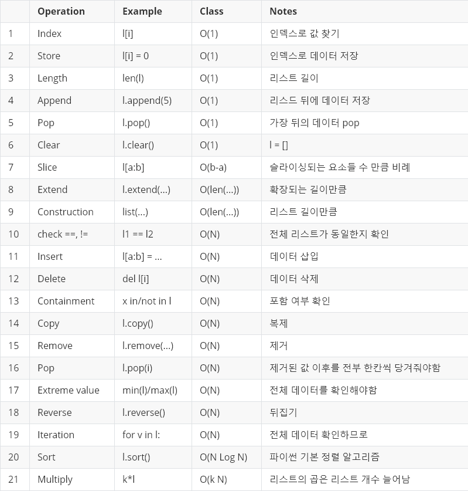

# 빅오(O, big-O)란?

입력값이 무한대로 향할 때 함수의 상한을 설명하는 수학적 표기 방법

➡️ 입력값이 커질 때, 알고리즘의 실행 시간(시간 복잡도)과 공간 요구사항(공간 복잡도)이 어떻게 증가하는지를 분류하는 데 사용되는 지표로, 알고리즘의 효율성을 분석하는 데 매우 유용하게 활용됨!

빅오는 점근적 실행시간(Asymptotic Running Time)을 표기할 때 가장 널리 쓰이며, 점근적 실행시간을 달리 말하면 **시간 복잡도**라고 한다. 빅오로 시간 복잡도를 표기할 때는 최고차항만을 표기하며, 계수는 무시한다. 

| 빅오 (big-O) | 실행 시간 | 설명 | 이용 |
| --- | --- | --- | --- |
| O(1) | 상수 | 입력값이 아무리 커도 실행시간은 일정한 최고의 알고리즘(입력값, 상수값에 관계 X) | 해시 테이블의 조회 및 삽입이 이에 해당함 |
| O(logn) | 로그 | 로그는 매우 큰 입력값에도 크게 영향을 받지 않는 편으로, 꽤나 견고한 알고리즘 | 이진 트리 검색 |
| O(n) | 선형 | 입력값만큼 실행시간에 영향. (시간과 입력값이 비례)
→ 선형 시간 알고리즘
→ 모든 입력값을 적어도 한 번 이상은 살펴봐야 함 | 리스트 순회
ex) 정렬 X 리스트에서 최댓값과 최솟값을 찾는 경우 |
| O(nlogn) | 로그 선형 | 대부분의 효율 좋은 정렬 알고리즘   *Tim Sort | 병합 정렬, 퀵 정렬 등 문제를 작은 덩어리로 분해한 다음, 그 결과를 병합하는 알고리즘 |
| O(n^2) | 2차 | 비효율적인 정렬 알고리즘 | 버블 정렬, 삽입 정렬, 선택 정렬 |
| O(2^n) | 지수 | O(n^2)보다 훨씬 큼 | 피보나치 수를 재귀로 계산하는 알고리즘 |
| O(n!) | 계승 | 가장 느린 알고리즘으로, 입력값이 조금만 커져도 웬만한 다항 시간 내에는 계산이 어려움 | n개의 모든 순서를 나열하기
ex) 브루트 포스의 풀이 |
| O(n^n) | 다항 | n번 순회하는 반복문이 n번 중첩 |  |

<aside>
💡 **알고리즘은 흔히 ‘시간과 공간이 트레이드오프(Space-Time Tradeoff)’ 관계이다. 
⇒ 실행 시간이 빠른 알고리즘은 공간을 많이 사용하고, 공간을 적게 차지하는 알고리즘은 실행 시간이 느리다.**

</aside>

### 상한과 최악

🚨 주의 - 빅오는 정확하게 쓰기에는 너무 길고 복잡한 함수를 ‘적당히 정확하게’ 표현하는 방법일 뿐, 최악의 경우/평균적인 경우의 시간 복잡도와는 아무런 관계가 없는 개념이다. 

<aside>
💡 **빅오 표기법은 주어진(최선/최악/평균) 경우의 수행 시간의 상한을 나타낸다.**

</aside>

## 분할 상환 분석

시간 또는 메모리를 분석하는 알고리즘의 복잡도를 계산할 때, 최악의 경우만 보지 않고 전체적인 알고리즘의 성능을 평가하는 방법이다. 최악의 경우를 여러 번에 걸쳐 골고루 나눠주는 형태이며, 최근에 유용하게 쓰인다. 

## 병렬화

GPU는 병렬 연산을 위한 대표적인 장치로, CPU의 코어보다는 훨씬 느리지만 더 많은 연산을 동시에 수행할 수 있어 실행 속도 향상에 기여하였다. 이로 인해 딥러닝 알고리즘에도 사용되며, 알고리즘의 우수성을 평가하는 척도로도 사용될 수 있다. 

# 자료형

## Python3 표준 타입 계층구조

- 숫자
    - 정수형
        - 정수(int)
            
            *long 형은 더이상 제공되지 않는다. 고정 정밀도 정수형인 int가 부족하면 임의 정밀도 정수형인 long으로 자동 변환되는 구조로 오버플로우 발생을 막을 수 있게 되었다. 
            
        - 불리언(boolean)
            
            #논리자료형
            
            파이썬에서 내부적으로 1(True)과 0(False)로 처리되는 int의 서브 클래스이다. ⇒ True == 1은 True를 반환한다.
            
    - 실수(float)
- 시퀀스
    
    → 수열 : 어떤 특정 대상의 순서 있는 나열
    
    - 불변
        - 문자열(str)
        - 튜플(tuple)
        - 바이트(bytes)
    - 가변
        - **리스트(list)**
            
            = 순서대로 저장하는 시퀀스 = 변경가능한 목록(*mutable list)*
            
            배열의 역할을 수행하며, 값을 자유롭게 추가 및 삭제할 수 있는 **동적 배열**이다. 파이썬은 다른 언어의 동적 배열과 달리 다양한 자료형을 단일 리스트로 관리할 수 있다는 특징이 있다. 
            *언어별 동적 배열 - Python: **list()**, C++: **std::vector**, Java: **ArrayList**
            
            
            
            리스트의 주요 연산 시간 복잡도
            
            리스트는 스택과 큐에서 사용 가능한 모든 연산 등 다양한 기능을 제공하며, 위와 같이 O(1)에 실행 가능한 연산들도 몇 가지 존재한다. 
            

            💡 파이썬 리스트가 가지는 주요 특징 - **연속된 공간에 요소를 배치하는 배열의 장점 + 다양한 타입을 연결하여 배치하는 연결리스트의 장점**
            

            실제 리스트는 구조체로 정의되어 있고, 객체로 이루어진 모든 자료형을 포인터로 연결한다. 리스트에 요소를 추가하거나 조작하면 ob_item의 사이즈를 조절해나가는 형태로 구현되어 있다. 
            
            즉, 제각각인 자료형으로 이루어지는 객체의 참조(포인터) 목록이므로 포인터가 가리키는 주소로 가서 해당 값에 접근할 수 있는 것이다. 
            
- 집합형
    - 집합(set)
        
        중복된 값을 갖지 않는 자료형으로, 딕셔너리와 동일하게 { } (중괄호)를 사용한다. 
        
- 매핑
    - **딕셔너리(dict)**
        
        키와 자료형(값)으로 구성된 복합 자료형으로, 딕셔너리는 파이썬에 내장된 유일한 매핑 자료형이다. 리스트와 함께 가장 빈번하게 사용된다. 
        
        입력 순서가 유지되며, 내부적으로 **해시 테이블**로 구현되어 있다.
        *언어별 해시 테이블 - Python : dict(), C++ : std::unordered_map, Java: HashMap
        
        딕셔너리는 리스트에서의 인덱스와 달리 다양한 타입을 키로 사용하는 해싱이 가능하여 키를 통한 입력과 조회 등 대부분의 연산이 모두 O(1)로 빠르게 처리가능한 매우 우수한 자료형이다. 
        **O(1)은 분할 상환 분석에 따른 시간 복잡도*
        
        이전 파이썬 버전에서는 순서 유지가 보장되지 않았지만, 3.7 버전부터는 내부적으로 인덱스를 이용해 입력 순서가 유지되도록 개선되었다. 
        *그러니 코딩할 때 무조건 순서가 보장된다는 생각은 안전하지 않음!
        
        활용 | 딕셔너리에서 존재하지 않는 키가 있는 경우에 대해 예외 처리를 함으로써 나중에 삽입하는 등의 별도 추가 작업이 가능하다!
        
        *딕셔너리 모듈
        
        - defaultdict 객체 - 존재하지 않는 키를 조회할 경우, 에러 메시지 출력 대신 디폴트 값을 기준으로 해당 키에 대한 딕셔너리 아이템을 생성해주는 객체 → collections.defaultfict 클래스
        - Counter 객체 - 아이템에 대한 개수를 계산해 딕셔너리로 리턴하는 객체 → collections.Counter 클래스
        - OrderedDict 객체 - 입력 그대로 순서가 유지되도록 하는 객체 
        *내부적으로 처리가 가능해지면서 더이상 필요X
        

위 자료형은 모두 객체이다. 파이썬은 모든 것이 객체로 이루어지며, 원시 타입이 아닌 객체를 사용하는 순간, 다음과 같은 특징이 있다.

👍 장점 - 문자/16진수로의 변환, 시프팅 같은 비트 조작을 지원

👎 단점 - 여러 부가정보 추가에 의한 메모리 점유율 증가, 계산 속도 감소

*원시타입, 객체 동시 지원 - Java / 원시타입만 지원 - C / 객체만 지원 -Python

## 객체

| 클래스 | 설명 | 불변 객체 |
| --- | --- | --- |
| bool | 부울 | O |
| int | 정수 | O |
| float | 실수 | O |
| list | 리스트 | X |
| tuple | 튜플   *리스트와 불변 여부 외에 거의 동일 | O |
| str | 문자 | O |
| set | 집합   *중복된 값 無 | X |
| dict | 딕셔너리 | X |

> IN 파이썬, **변수를 할당한다 = 해당 객체에 대해 참조한다**는 의미를 지닌다.
> 

숫자와 문자의 변수는 상수처럼 읽기전용으로만 사용하거나 값이 변하지 않기 때문에 dict의 키나 set의 값으로도 사용할 수 있다. 

*list는 가변객체이므로, dict의 키나 set의 값으로는 사용할 수 없다. 

### 속도

파이썬의 객체는 값을 꺼내는 과정에서 타입 코드를 찾는 등의 이유로 속도가 현저히 느려진다. 파이썬에서 빠른 연산을 지원하는 numPy 모듈도 C 를 기반으로 하는 모듈이며, 내부적으로 리스트를 C의 원시타입으로 처리하기 때문에 빠르다고 할 수 있다.